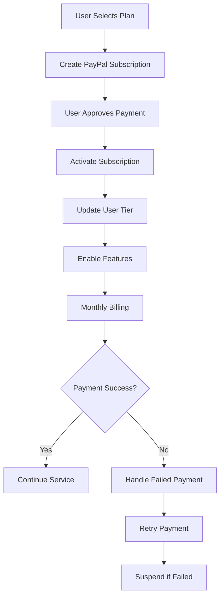

# AnimaGenius - Technical Architecture Documentation

## 🏗️ System Overview

AnimaGenius is a production-ready, enterprise-grade AI-powered video synthesis SaaS platform built on a modern, scalable architecture designed to handle thousands of concurrent users and process large-scale media files efficiently.

## 📊 Architecture Diagram

```
┌─────────────────────────────────────────────────────────────┐
│                    FRONTEND LAYER                           │
├─────────────────────────────────────────────────────────────┤
│  Next.js 15 App Router  │  React 19  │  TypeScript         │
│  Tailwind CSS + shadcn  │  Zustand   │  React Query        │
│  Theme Provider         │  Forms     │  Authentication     │
└─────────────────────────────────────────────────────────────┘
                               │
                               ▼
┌─────────────────────────────────────────────────────────────┐
│                    API LAYER                                │
├─────────────────────────────────────────────────────────────┤
│  NextAuth.js Sessions   │  Rate Limiting  │  Validation     │
│  API Routes (RESTful)   │  Error Handling │  Middleware     │
│  File Upload Handler    │  WebSocket      │  Caching        │
└─────────────────────────────────────────────────────────────┘
                               │
                               ▼
┌─────────────────────────────────────────────────────────────┐
│                  BUSINESS LOGIC LAYER                       │
├─────────────────────────────────────────────────────────────┤
│  File Processors        │  AI Services    │  Subscription   │
│  Video Rendering        │  Content Mgmt   │  User Mgmt      │
│  Queue Management       │  Analytics      │  Admin Panel    │
└─────────────────────────────────────────────────────────────┘
                               │
                               ▼
┌─────────────────────────────────────────────────────────────┐
│                    DATA LAYER                               │
├─────────────────────────────────────────────────────────────┤
│  PostgreSQL Database    │  Redis Cache    │  File Storage   │
│  Prisma ORM            │  Session Store  │  CDN            │
│  Migrations            │  Queue Storage  │  Backups        │
└─────────────────────────────────────────────────────────────┘
                               │
                               ▼
┌─────────────────────────────────────────────────────────────┐
│                  EXTERNAL SERVICES                          │
├─────────────────────────────────────────────────────────────┤
│  PayPal Subscriptions   │  OpenRouter AI  │  Cloud Storage  │
│  OAuth Providers        │  Email Service  │  CDN Providers  │
│  Monitoring Services    │  Analytics      │  Error Tracking │
└─────────────────────────────────────────────────────────────┘
```

## 🔧 Core Components

### 1. Frontend Architecture

**Technology Stack:**
- **Framework**: Next.js 15 with App Router
- **UI Library**: React 19 with TypeScript
- **Styling**: Tailwind CSS 4.1 + shadcn/ui components
- **State Management**: Zustand for global state, React Query for server state
- **Forms**: React Hook Form with Zod validation
- **Authentication**: NextAuth.js with session management

**Key Features:**
- Server-side rendering (SSR) for optimal SEO
- Client-side hydration for interactive components
- Progressive Web App (PWA) capabilities
- Responsive design with dark/light theme support
- Real-time updates via WebSocket connections

### 2. API Layer Architecture

**RESTful API Design:**
```
/api/v1/
├── auth/                 # Authentication endpoints
├── users/                # User management
├── files/                # File upload and processing
├── ai/                   # AI processing services
├── video/                # Video rendering
├── subscriptions/        # PayPal billing
└── admin/                # Admin panel APIs
```

**Middleware Stack:**
1. **Authentication**: NextAuth.js session validation
2. **Rate Limiting**: Per-user and per-IP request throttling
3. **Validation**: Zod schema validation for all inputs
4. **Error Handling**: Structured error responses with logging
5. **Caching**: Redis-based response caching
6. **Monitoring**: Request/response logging and metrics

### 3. Database Schema

**PostgreSQL with Prisma ORM:**

```sql
-- Core Tables
users (id, email, subscription_tier, created_at)
projects (id, user_id, title, status, ai_script, video_url)
subscriptions (id, user_id, paypal_subscription_id, status)
usage_metrics (id, user_id, action, resource_type, timestamp)

-- Admin Tables
admin_logs (id, admin_id, action, target_type, details)
system_config (id, key, value, category)

-- Processing Tables
render_jobs (id, project_id, status, progress, provider)
assets (id, project_id, type, url, metadata)
file_processing_logs (id, project_id, step, status)
```

**Indexing Strategy:**
- Primary keys: UUID with clustered indexes
- Foreign keys: B-tree indexes for joins
- Search fields: GIN indexes for full-text search
- Timestamps: B-tree indexes for range queries
- Composite indexes for complex queries

### 4. Caching Strategy

**Redis Multi-Layer Caching:**

```typescript
// Cache Hierarchy
L1: User Sessions (NextAuth.js) → 24 hours
L2: API Responses → 5 minutes - 1 hour
L3: Database Queries → 1-10 minutes
L4: File Processing Results → 24 hours
L5: Analytics Data → 1 hour
```

**Cache Invalidation:**
- Time-based expiry for most data
- Event-based invalidation for user data
- Manual invalidation for admin changes
- Background refresh for heavy computations

## 🤖 AI Services Architecture

### OpenRouter Integration

**Custom Endpoint Configuration:**
```typescript
const AI_CONFIG = {
  endpoint: 'https://oi-server.onrender.com/chat/completions',
  customerId: 'cus_SFkzlM4lBe5pBM',
  models: {
    chat: 'openrouter/anthropic/claude-sonnet-4',
    script: 'openrouter/openai/gpt-4o',
    image: 'replicate/black-forest-labs/flux-1.1-pro',
    video: 'replicate/google/veo-3'
  }
}
```

**AI Processing Pipeline:**
1. **Content Analysis**: Extract and analyze uploaded content
2. **Script Generation**: Create video scripts with timing
3. **Asset Curation**: Generate supporting visual assets
4. **Voice Generation**: Text-to-speech conversion
5. **Video Composition**: Combine all elements into final video

**Multimodal Support:**
- Text analysis and processing
- Image OCR and description
- Audio transcription via Whisper
- Video content analysis
- PDF and document parsing

## 💳 Payment Architecture

### PayPal Subscription Integration

**Subscription Lifecycle:**


**Webhook Handling:**
- `BILLING.SUBSCRIPTION.CREATED`
- `BILLING.SUBSCRIPTION.ACTIVATED`
- `BILLING.SUBSCRIPTION.CANCELLED`
- `PAYMENT.SALE.COMPLETED`
- `PAYMENT.SALE.DENIED`

## 🎬 Video Processing Architecture

### Multi-Provider Rendering System

**Provider Selection Algorithm:**
```typescript
function selectProvider(userTier, complexity, currentLoad) {
  if (userTier === 'ENTERPRISE') return 'premium_provider'
  if (complexity === 'high') return 'specialized_provider'
  if (currentLoad < 0.7) return 'primary_provider'
  return 'fallback_provider'
}
```

**Queue Management:**
- Priority-based job scheduling
- Load balancing across providers
- Automatic retry with exponential backoff
- Progress tracking and status updates
- Resource optimization

**Output Formats:**
- MP4 (H.264/H.265)
- WebM for web optimization
- GIF for social media
- Multiple resolutions (720p, 1080p, 4K)

## 🔐 Security Architecture

### Authentication & Authorization

**Multi-Layer Security:**
1. **Session Management**: NextAuth.js with JWT tokens
2. **Role-Based Access Control**: User, Admin, Super Admin roles
3. **API Authentication**: Bearer token validation
4. **Admin Panel Security**: Separate authentication layer

**Data Protection:**
- AES-256 encryption for sensitive data
- Password hashing with bcryptjs
- SQL injection prevention via Prisma
- XSS protection with content security policies
- Rate limiting to prevent abuse

### File Security

**Upload Security:**
- File type validation
- Size restrictions by subscription tier
- Virus scanning (when integrated)
- Content moderation for AI processing
- Secure storage with signed URLs

## 📊 Admin Panel Architecture

### External Access Design

**Admin Panel Features:**
```
/admin/
├── dashboard/           # System overview and metrics
├── users/              # User management and moderation  
├── subscriptions/      # Billing and subscription management
├── content/            # Content moderation and policies
├── analytics/          # Advanced reporting and insights
├── settings/           # Platform configuration
└── logs/               # Admin activity and audit logs
```

**Permission Levels:**
- **Super Admin**: Full system access, user promotion
- **Admin**: User management, content moderation
- **Moderator**: Content review only

**External Access Requirements:**
- Production-ready deployment
- Secure HTTPS connections
- VPN or IP whitelist options
- Multi-factor authentication
- Session timeout policies

## 🚀 Scalability & Performance

### Horizontal Scaling Strategy

**Application Scaling:**
- Stateless API design for load balancing
- Redis for shared session storage
- Background job processing with queues
- CDN for global content delivery
- Database read replicas for query scaling

**Auto-Scaling Triggers:**
- CPU usage > 70%
- Memory usage > 80%
- Request queue > 100 items
- Response time > 2 seconds
- Error rate > 5%

### Performance Optimizations

**Frontend Optimizations:**
- Code splitting by route
- Image optimization with Next.js
- Static generation for landing pages
- Progressive loading for large datasets
- Service worker for offline functionality

**Backend Optimizations:**
- Database query optimization
- Connection pooling
- Background job processing
- Caching at multiple layers
- Compression for API responses

## 📈 Monitoring & Analytics

### System Monitoring

**Key Metrics:**
- Response time percentiles (P50, P95, P99)
- Error rates by endpoint
- Database query performance
- Redis hit/miss ratios
- File processing success rates

**Alerting System:**
- Critical errors: Immediate notification
- High error rates: 5-minute threshold
- Performance degradation: 15-minute threshold
- Resource exhaustion: Predictive alerts
- Security incidents: Real-time alerts

### Business Analytics

**User Metrics:**
- Signup conversion rates
- Feature adoption rates
- Churn analysis
- Usage patterns
- Support ticket analysis

**Revenue Metrics:**
- Monthly Recurring Revenue (MRR)
- Customer Lifetime Value (CLV)
- Customer Acquisition Cost (CAC)
- Churn rate by plan tier
- Upgrade/downgrade patterns

## 🔄 Deployment Architecture

### Production Environment

**Infrastructure Requirements:**
```yaml
Frontend/API:
  - CPU: 2+ cores per instance
  - RAM: 4GB+ per instance
  - Storage: SSD for application files
  - Scaling: Auto-scaling groups

Database:
  - PostgreSQL: 4+ cores, 16GB+ RAM
  - Redis: 2+ cores, 8GB+ RAM
  - Storage: SSD with automated backups
  - Monitoring: Query performance tracking

File Storage:
  - CDN: Global distribution
  - Storage: Object storage (S3-compatible)
  - Backup: Geographic redundancy
  - Security: Signed URLs, access controls
```

**Deployment Pipeline:**
1. **Development**: Feature branch deployment
2. **Staging**: Integration testing environment
3. **Production**: Blue-green deployment
4. **Rollback**: Automatic rollback on errors
5. **Monitoring**: Post-deployment validation

### Disaster Recovery

**Backup Strategy:**
- Database: Automated daily backups with point-in-time recovery
- Files: Geographic redundancy across multiple regions
- Configuration: Version-controlled infrastructure as code
- Monitoring: Backup verification and testing

**Recovery Procedures:**
- RTO (Recovery Time Objective): < 4 hours
- RPO (Recovery Point Objective): < 1 hour
- Automated failover for critical services
- Manual procedures for complex scenarios
- Regular disaster recovery testing

## 🔧 Development Workflow

### Code Organization

**Modular Architecture:**
```
src/
├── app/                 # Next.js app directory
├── components/          # Reusable UI components
├── lib/                # Business logic and utilities
├── types/              # TypeScript type definitions
├── hooks/              # Custom React hooks
└── styles/             # Global styles and themes
```

**Development Standards:**
- TypeScript for type safety
- ESLint and Prettier for code formatting
- Husky for pre-commit hooks
- Conventional commits for version control
- Unit and integration testing

### Testing Strategy

**Testing Pyramid:**
- Unit Tests: 70% coverage for business logic
- Integration Tests: API endpoint testing
- E2E Tests: Critical user flows
- Performance Tests: Load and stress testing
- Security Tests: Vulnerability scanning

## 📋 Maintenance & Updates

### Regular Maintenance

**Weekly Tasks:**
- Dependency security updates
- Performance metric review
- Error log analysis
- User feedback review
- System health checks

**Monthly Tasks:**
- Database optimization
- Cache performance review
- Security audit
- Backup verification
- Capacity planning

**Quarterly Tasks:**
- Architecture review
- Technology upgrade planning
- Disaster recovery testing
- Security penetration testing
- Business metric analysis

This architecture document provides a comprehensive overview of the AnimaGenius platform's technical implementation, designed for enterprise-scale deployment with high availability, security, and performance requirements.